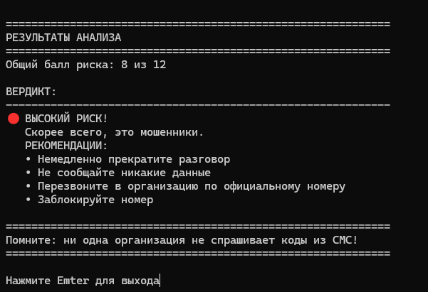

# call-risk-calculator
Консольная программа на Python, которая помогает оценить, насколько телефонный звонок может быть рискованным. Задаёт вопросы, считает баллы и выдаёт вердикт: "Высокий риск", "Средний риск" или "Низкий риск".

.png)

#Как запустить

1. Установи Python (если не установлен) с официального сайта.
2. Скачай файл 'risk_calculator' из этого репозитория.
3. Открой терминал в папке с файлом и выполни:
   python risk_calculator.py

